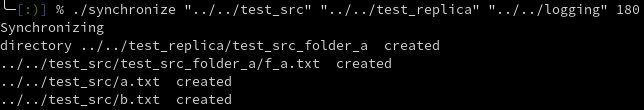
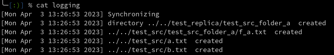

# VEEAM TEST TASK 
[by Daria Kuzmina](https://github.com/ivddorrka)

## Source code

1. [Include](https://github.com/ivddorrka/veeam_test/tree/master/include)
- [error_codes.h](https://github.com/ivddorrka/veeam_test/blob/master/include/error_codes.h) - return codes to avoid magical numbers
- [synchro_logic.h](https://github.com/ivddorrka/veeam_test/blob/master/include/synchro_logic.h) - header with program's logic functions declarations
2. [SRC](https://github.com/ivddorrka/veeam_test/tree/master/src)
-[synchro_logic.cpp](https://github.com/ivddorrka/veeam_test/blob/master/src/synchro_logic.cpp) - implementations for functions delcared in [include folder](https://github.com/ivddorrka/veeam_test/tree/master/include)

3. [main](https://github.com/ivddorrka/veeam_test/blob/master/main.cpp)
- Starts the program
- Checks for initial issues

## Compilation 

* Clone the project: 
``` 
git clone git@github.com:ivddorrka/veeam_test.git
```

* In root directory of the project:
```
mkdir build
cd build 
cmake ..
make
```
### The result of this will be a bin directory in build with an executive file (named synchronize) in it 

## Execution 

* In build/bin directory run the following: 

```
./synchronize "../../test_src" "../../test_replica" "../../logging" 180 
```

* Programm accepts 4 arguments in the following order: 
* source folder - there's a test_src folder provided by me for testing the program
* replica folder - is not necessarily to exist - will be created if so
* logging file  - is not necessarily to exist - will be created if so
* interval specified in seconds 

### Important !!!

* The program will be in an infinite running loop until stopped 
* The logging is being output both to the console and logging file (should be specified) 

### Example of execution in command line: 



### Logging file example: 




